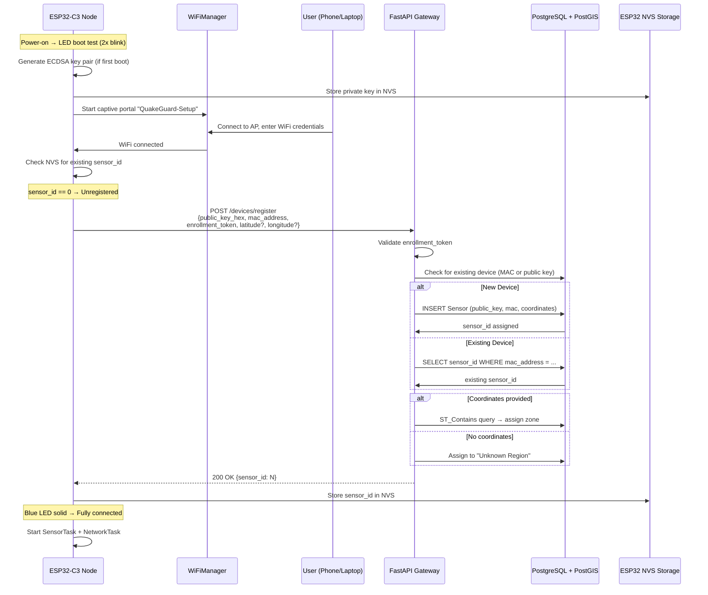

# Sequence Diagram — Device Provisioning (First Boot)

```mermaid
sequenceDiagram
    participant ESP as ESP32-C3 Node
    participant WM as WiFiManager
    participant User as User (Phone/Laptop)
    participant API as FastAPI Gateway
    participant DB as PostgreSQL + PostGIS
    participant NVS as ESP32 NVS Storage

    Note over ESP: Power-on → LED boot test (2x blink)
    ESP->>ESP: Generate ECDSA key pair (if first boot)
    ESP->>NVS: Store private key in NVS

    ESP->>WM: Start captive portal "QuakeGuard-Setup"
    User->>WM: Connect to AP, enter WiFi credentials
    WM->>ESP: WiFi connected

    ESP->>ESP: Check NVS for existing sensor_id
    Note over ESP: sensor_id == 0 → Unregistered

    ESP->>API: POST /devices/register<br/>{public_key_hex, mac_address,<br/>enrollment_token, latitude?, longitude?}

    API->>API: Validate enrollment_token
    API->>DB: Check for existing device (MAC or public key)

    alt New Device
        API->>DB: INSERT Sensor (public_key, mac, coordinates)
        DB->>API: sensor_id assigned
    else Existing Device
        API->>DB: SELECT sensor_id WHERE mac_address = ...
        DB->>API: existing sensor_id
    end

    alt Coordinates provided
        API->>DB: ST_Contains query → assign zone
    else No coordinates
        API->>DB: Assign to "Unknown Region"
    end

    API-->>ESP: 200 OK {sensor_id: N}
    ESP->>NVS: Store sensor_id in NVS
    Note over ESP: Blue LED solid → Fully connected
    ESP->>ESP: Start SensorTask + NetworkTask
```
